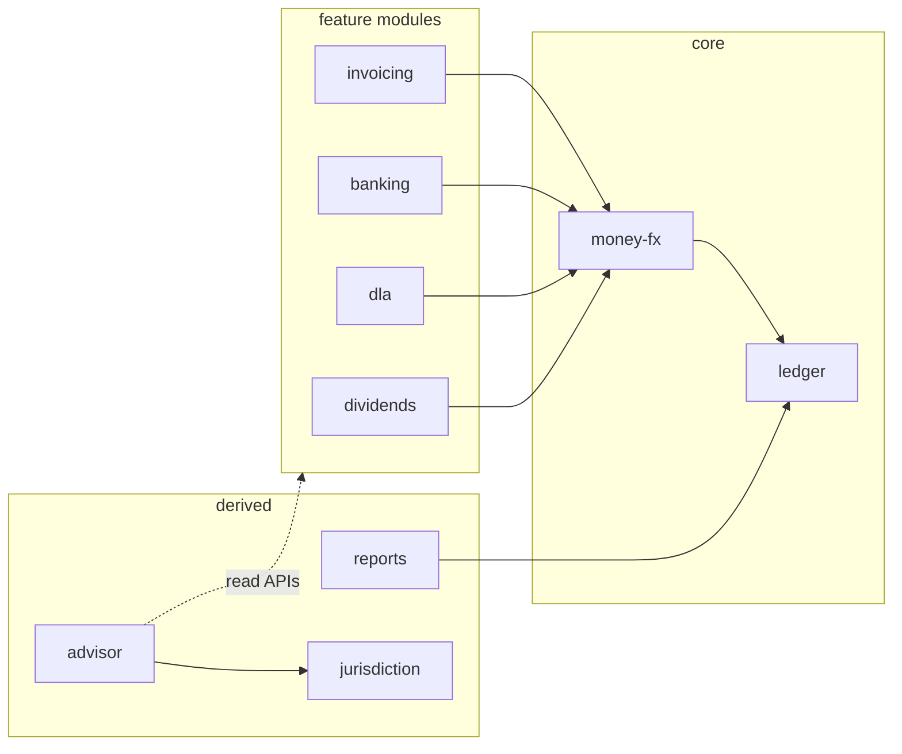

<div align="center">

# Ledgerly

**Jurisdiction-aware bookkeeping for single-director companies.**

Multi-currency invoicing · double-entry ledger · bank reconciliation · dividend paperwork · a compliance advisor that never guesses — all in one small, self-hostable binary.

[](LICENSE)
[](https://github.com/npmulder/Ledgerly/actions/workflows/ci.yml)
[](docs/design/hld.md)
[](CONTRIBUTING.md)

</div>

---

## What is Ledgerly?

Running a one-person limited company means juggling invoices in two currencies, reconciling bank feeds, watching your director's loan account, working out how much you can safely take as dividends — and never being quite sure which filing deadline is creeping up. General-purpose accounting suites are built for accountants; Ledgerly is built for the **owner-director** who does their own books.

- 💶 **Multi-currency invoicing** — invoice in EUR or GBP with the ECB rate locked at issue time; realised FX gain/loss is computed automatically on settlement.
- 📒 **Double-entry ledger underneath everything** — append-only journal; every balance is derivable from postings. No magic numbers, no drift.
- 🏦 **Bank reconciliation** — CSV import (Revolut GBP + EUR first), match suggestions, one-click reconcile.
- 💷 **Director's loan account** — running ledger with overdrawn detection and benefit-in-kind warnings.
- 📄 **Dividend paperwork, done** — headroom calculation plus generated dividend vouchers and board minutes as PDFs.
- 📊 **Reports & filings** — P&L, VAT return figures, a filing calendar, and an export pack for your accountant.
- 🧭 **A deterministic compliance advisor** — a rule engine (not an LLM) that evaluates your books against a versioned jurisdiction rules pack and surfaces insights: deadlines, warnings, opportunities. Auditable and testable, as compliance tooling should be.
- 🤖 **CLI + MCP server** — AI agents (Claude Code, Codex, …) consume Ledgerly as a tool over the same API you use.

**v1 jurisdiction: Isle of Man** — deliberately not UK; the rules differ materially. All tax rates, deadlines, and advisor wording live in a versioned rules pack (`isle-of-man@1.0`), never in code. Adding a jurisdiction means adding a pack, not forking modules.

## Design principles

From the [high-level design](docs/design/hld.md):

1. **Correctness over scale.** One company, one or two users, tens of invoices a month. Every design decision favours being right over being fast.
2. **No floats in money paths.** Money is `int64` minor units + currency; allocation uses largest-remainder so pennies never leak.
3. **Append-only ledger.** Journal rows are never updated or deleted; auditability is structural, not procedural.
4. **Jurisdiction as data.** Nothing outside the `jurisdiction` module hard-codes a tax rate, deadline, or advisor sentence — CI guards enforce it.
5. **Modular monolith with real boundaries.** One binary, but each module gets its own PostgreSQL schema and DB role; modules interact only through public Go interfaces and domain events. Boundary violations are compile/runtime errors, not review comments.

## Architecture

A single Go binary serving a React SPA, with strict internal module boundaries:



Modules communicate two ways: synchronous calls through a module's public interface (`api.go` — the only thing other modules may import), and domain events on an in-process bus with a transactional outbox (`invoicing.InvoiceSettled` → money-fx posts realised FX to the ledger, in the same DB transaction).

Dig deeper:

- 📘 [High-level design](docs/design/hld.md) — architecture, trade-offs, build order
- 📗 Module designs: [core-ledger](docs/design/modules/core-ledger.md) · [core-money-fx](docs/design/modules/core-money-fx.md) · [invoicing](docs/design/modules/invoicing.md) · [banking](docs/design/modules/banking.md) · [dla](docs/design/modules/dla.md) · [dividends](docs/design/modules/dividends.md) · [reports](docs/design/modules/reports.md) · [compliance-jurisdiction](docs/design/modules/compliance-jurisdiction.md) · [advisor](docs/design/modules/advisor.md) · [settings-identity](docs/design/modules/settings-identity.md) · [cli](docs/design/modules/cli.md)
- 🧪 [Testing guide](docs/testing.md) — unit, integration, golden, and harness conventions
- 🎨 [Design handoff](docs/design_handoff_keel/README.md) — nine high-fidelity screens and design tokens

## Tech stack

| Layer | Choice |
|---|---|
| Backend | Go (modular monolith), [chi](https://github.com/go-chi/chi) router |
| Database | PostgreSQL 16 (Docker Compose locally), schema-per-module |
| Frontend | React + TypeScript (Vite), TanStack Query, React Router |
| API | REST/JSON with OpenAPI 3, generated TS client |
| Documents | React print routes rendered to PDF via chromedp |
| FX rates | ECB daily reference rates (cron fetch) |
| Agents | `ledgerly` CLI + stdio MCP server |

## Project status

> **🚧 Design phase.** The architecture and all eleven module designs are complete; implementation is starting with the walking skeleton (see [build order](docs/design/hld.md#12-suggested-build-order-breakdown-seed)). There is no runnable application yet — what you can set up today is the development toolchain below.

## Getting started (contributors)

Ledgerly pins its toolchain with [mise](https://mise.jdx.dev) and automates chores with [Task](https://taskfile.dev).

Install go-task with:

```sh
go install github.com/go-task/task/v3/cmd/task@latest
```

Current `task --list` output:

```text
task: Available tasks for this project:
* build:                  Build and vet all Go packages
* ci:                     Run the same checks as CI
* lint:                   Run all lint checks
* run:                    Run the ledgerly skeleton
* test:                   Run unit tests
* lint:arch:              Enforce internal module import boundaries
* lint:fmt:               Check Go formatting
* lint:golangci:          Run golangci-lint
* lint:rates:             Prevent compliance literals outside jurisdiction packs
* test:integration:       Run integration tests
```

See [CONTRIBUTING.md](CONTRIBUTING.md) for the full development guide, including the module-boundary rules every PR is held to.

### First run

Start PostgreSQL, run `ledgerly migrate`, then start `ledgerly serve` with the
required `LEDGERLY_*` runtime configuration. A blank production or staging
database is intentionally left without tenant data by migrations; create the
first owner account and company profile by opening `/register`.

Local development can still opt into the NPM Limited convenience profile for
fixtures and smoke flows by using the default local dev database or setting
`LEDGERLY_DEV_SEED_DATA=true` when running migrations.

## Module directory convention

Each module under `internal/<module>/` will use:

- `api.go` for the public interface other modules may import
- `events.go` for published event types
- `service.go` for module orchestration
- `store.go` for private persistence
- `http.go` for REST handlers

## Contributing

Contributions are welcome — especially once the walking skeleton lands. Please read [CONTRIBUTING.md](CONTRIBUTING.md) first; Ledgerly has strict architectural rules (module boundaries, money handling, jurisdiction data) that reviews enforce firmly.

Found a security issue? Please **don't** open a public issue — see [SECURITY.md](SECURITY.md).

## License

Ledgerly is licensed under the [Apache License 2.0](LICENSE).
